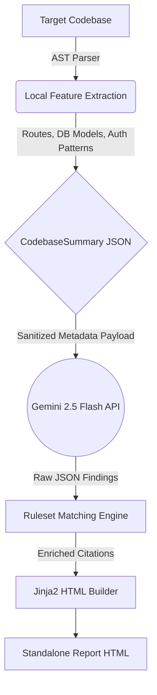

# AuditX 🛡️
### AI Compliance Gap Scanner for Indian Startups


**AuditX** is a powerful, local-first Python CLI tool that analyzes a startup's backend codebase to identify compliance gaps. It maps vulnerabilities directly to crucial Indian regulatory frameworks, generating action-oriented, standalone HTML reports.

---

## ✨ Features

- **Local-First AST Parsing**: Uses `tree-sitter` to parse your backend code locally. **Raw source code is never sent to the cloud.**
- **AI-Powered Analysis**: Leverages the **Google Gemini 2.5 Flash** model for intelligent compliance reasoning based strictly on the extracted AST metadata.
- **Regulatory Mapping**: Automatically maps code behaviors to explicit clauses in:
  - 🇮🇳 **DPDP Act 2023** (Data Minimization, Breach Notification, Children's Data)
  - 🏦 **RBI Guidelines** (Card Tokenization, KYC Minimization)
  - 💳 **PCI-DSS v4.0** (Account Data Protection, Secure System Development)
  - 🛡️ **CERT-In Directions 2022** (Log Retention, Incident Reporting)
- **Beautiful HTML Reports**: Generates a self-contained, printable HTML report summarizing severities, exact code locations, legal obligations, and actionable remediation steps.

---

## 🏗️ How it Works (Architecture)



---

## 🚀 Quick Start

### 1. Installation

```bash
# Clone the repository
git clone https://github.com/Yatharth-Bhavsar/AuditX.git
cd AuditX

# Install the package locally
pip install -e .

# Set up your environment variables
cp .env.example .env
```

### 2. Configuration
Open the `.env` file and add your Google Gemini API Key:
```env
GEMINI_API_KEY=your_gemini_api_key_here
```
*(You can get a free key from [Google AI Studio](https://aistudio.google.com/apikey))*

### 3. Usage

Run your first scan against the included demo repository:

```bash
auditx scan ./demo_repo --profile fintech
```

> **Note for Windows users**: If the `auditx` command is not recognized due to PATH issues, you can run the tool as a Python module:
> ```bash
> python -m auditx scan ./demo_repo --profile fintech
> ```

---

## 📊 Compliance Profiles

AuditX supports specific regulatory configurations depending on your startup type:

| Profile | Target Audience | Frameworks Validated |
| :--- | :--- | :--- |
| `--profile fintech` | Financial services, Payment gateways, Neobanks | DPDP + RBI + PCI-DSS + CERT-In |
| `--profile saas` | Standard B2B/B2C SaaS platforms | DPDP + CERT-In |

---

## ⚠️ Demo Screenshots


---
## ⚠️ Limitations

- The prototype is currently optimized for **Python** and **JavaScript/TypeScript** backend codebases.
- LLM reasoning may occasionally produce false positives. **Treat the generated report as a starting point for human engineering review, not as a legal compliance certificate.**
- The free tier Gemini API has constraints: max 500 scans/day, and responses are rate-limited to 3 API calls per scan payload (with built-in 12-second safety delays).

---

## 🛣️ V2 Roadmap

- [ ] **Automated VAPT analysis:** Integrate OWASP Top 10 taint analysis natively into the AST parsing logic.
- [ ] **Delta Scanning:** Run autonomous scans on Git commit hooks via CI/CD pipelines.
- [ ] **Expanded Profiles:** Add dedicated data compliance setups for `edtech` (handling minors' data) and `ecommerce`.
