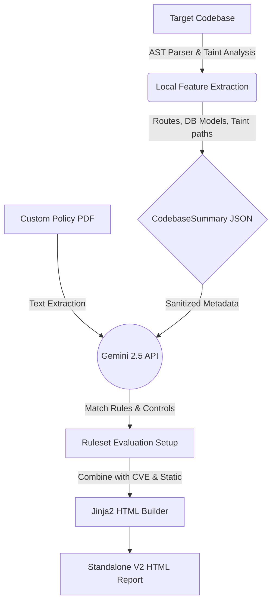

# AuditX 🛡️ (v2.0)
### AI Compliance Gap Scanner for Indian Startups


**AuditX** is a powerful, local-first Python CLI tool that analyzes a startup's backend codebase to identify compliance gaps. It maps vulnerabilities directly to crucial Indian regulatory frameworks, generating action-oriented, standalone HTML reports.

**Version 2.0** introduces a rich interactive CLI, automated VAPT (Vulnerability Assessment and Penetration Testing) with OWASP Top 10 enrichment, dependency CVE scanning, and the ability to upload **custom policy documents (PDF)** for cross-verification against your codebase!

---

## ✨ Features (New in v2)

- **Local-First AST Parsing**: Uses `tree-sitter` to parse your backend code locally. **Raw source code is never sent to the cloud.**
- **AI-Powered Analysis**: Leverages the **Google Gemini 2.5 Flash** model for intelligent compliance reasoning.
- **Automated VAPT & Taint Analysis**: Now checks for weak cryptography, missing bounds, and cross-site scripting flaws using AST taint analysis.
- **Dependency CVE Scanning**: Flags vulnerable upstream packages in your requirements/package-lock.
- **Interactive Console**: Run `auditx start` for a guided, terminal UI experience with animations and spinners.
- **Custom Policy Assessment**: Upload any corporate security framework or ISO/SOC2 standard PDF; AuditX will extract AI controls and score your codebase against *your own rules*.
- **Regulatory Mapping**: Automatically maps code behaviors to explicit clauses in:
  - 🇮🇳 **DPDP Act 2023** 
  - 🏦 **RBI Guidelines** 
  - 💳 **PCI-DSS v4.0** 
  - 🛡️ **CERT-In Directions 2022** 
- **Beautiful HTML Reports**: Generates printable HTML reports with risk scores, missing controls, and exact code locations.

---

## 🏗️ Architecture



---

## 🚀 Quick Start

### 1. Installation

```bash
# Clone the repository
git clone https://github.com/Yatharth-Bhavsar/AuditX.git
cd AuditX

# Install the package locally
pip install -e .

# Set up your environment variables
cp .env.example .env
```

### 2. Configuration
Open the `.env` file and add your Google Gemini API Key:
```env
GEMINI_API_KEY=your_gemini_api_key_here
```
*(You can get a free key from [Google AI Studio](https://aistudio.google.com/apikey))*

### 3. Usage

**Interactive Mode (Recommended)**
AuditX now comes with a rich terminal UI! Let the assistant guide you through the audit process.
```bash
auditx start
```

**Headless CLI scan**
Run a scan against the included demo repository:
```bash
auditx scan ./demo_repo --profile fintech
```

**Custom Policy Scanning**
If your company has custom security guidelines, you can scan against them! Provide the path to a PDF Document:
```bash
auditx scan ./demo_repo --profile saas --custom-policy ./corporate_policy.pdf
```

> **Note for Windows users**: If the `auditx` command is not recognized due to PATH issues, you can run the tool as a Python module:
> `python -m auditx start`

---

## ☁️ How to Deploy & Self-Host

You can integrate AuditX into your existing workflows, such as CI/CD pipelines, giving developers instant feedback on PRs.

### CI/CD Integration (GitHub Actions Example)
AuditX operates entirely as a local package, requiring only the Gemini API. You can run it effortlessly on GitHub Actions:

```yaml
name: AuditX Compliance Scan
on: [pull_request]

jobs:
  audit:
    runs-on: ubuntu-latest
    steps:
      - uses: actions/checkout@v3
      - name: Setup Python
        uses: actions/setup-python@v4
        with:
          python-version: '3.11'
      
      - name: Install AuditX
        run: |
          git clone https://github.com/Yatharth-Bhavsar/AuditX.git /tmp/auditx
          pip install -e /tmp/auditx
          
      - name: Run Scan
        env:
          GEMINI_API_KEY: ${{ secrets.GEMINI_API_KEY }}
        run: auditx scan ./ --profile fintech --output compliance_report.html
        
      - name: Upload Artifact
        uses: actions/upload-artifact@v3
        with:
          name: AuditX-Report
          path: compliance_report.html
```

### Extending / Contributing
1. Create a virtual environment (`python -m venv venv`) and activate it.
2. Install dependencies: `pip install -r requirements.txt`.
3. Add new profiles in `auditx/rules.py` or new compliance features to the `cli.py` pipeline.
4. Run tests or generate sample scans locally before pushing changes.

---

## 📊 Compliance Profiles

AuditX supports specific regulatory configurations depending on your startup type:

| Profile | Target Audience | Frameworks Validated |
| :--- | :--- | :--- |
| `--profile fintech` | Financial services, Payment gateways, Neobanks | DPDP + RBI + PCI-DSS + CERT-In |
| `--profile saas` | Standard B2B/B2C SaaS platforms | DPDP + CERT-In |
| `--profile healthcare` | HealthTech platforms handling PHI | HIPAA principles + DPDP |

---

## ⚠️ Demo Screenshots

*enhanced report and scoring system to analyse your organisation's overall audit score based on certain parameters.*

<!-- The user wants to include the new screenshots here -->
[//]: # (Please insert the new image links or save the images in the repo and provide paths!)

*Note: The platform is still under developement. Feel frree to reachout.*

---

## ⚠️ Limitations

- The prototype is currently optimized for **Python** and **JavaScript/TypeScript** backend codebases.
- LLM reasoning may occasionally produce false positives. **Treat the generated report as a starting point for human engineering review.**
- Free tier Gemini API limit: max 500 scans/day. AuditX implements safety delays (rate limiting) to respect these quotas.

---

## 🛣️ Roadmap (V3)
- [ ] Auto-remediation script generation (providing patched files).
- [ ] Enhanced dependency mapping using Software Bill of Materials (SBOM) generation.
